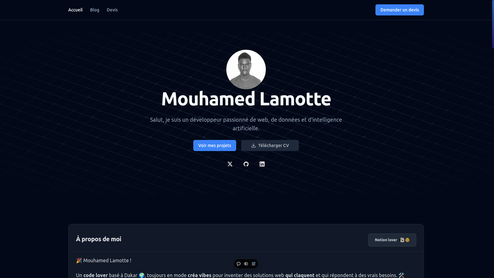

# Mon Portfolio 🚀  


[Apercue du Portfolio](https://www.mouhamedlamotte.tech)




Bienvenue dans le dépôt de mon portfolio ! Ce projet est une application full-stack construite avec **Next.js**, mettant en avant mes projets, expériences, compétences, et certifications.  

## 🌟 Fonctionnalités  

- **Présentation dynamique** : Le contenu du portfolio est entièrement géré via une API backend et une interface d'administration.  
- **Admin Space** : Une interface simple et intuitive pour gérer les données du portfolio, notamment :  
  - Projets  
  - Expériences professionnelles  
  - Certifications  
  - Éducation  
  - Centres d'intérêt  
- **Blog** : Integration du blog avec Notion.  
- **Personnalisation** : Support futur pour des templates personnalisables.  

## 🛠️ Technologies utilisées  

- **Frontend** :  
  - Next.js  
  - Tailwind CSS  
  - React Query  
  - Shadcn UI  

- **Backend** :  
  - API REST avec Next.js  
  - Prisma pour la gestion des données
  - PostgreSQL pour la base de données
  - Redis pour la cache  
  - Notion API pour le blog

## 📚 Installation et configuration  

* POV : Forkez le projet avant de le cloner 

1. Clonez le dépôt :  
   ```bash
   git clone https://github.com/votre-nom-dutilisateur/portfolio.git
   cd portfolio
   ```  

2. Installez les dépendances :  
   ```bash
   pnpm install
   ```  

3. Configurez les variables d'environnement :  
   copiez le fichier `.env.example` 
    ```bash
    cp .env.example .env
    ```
    et ajoutez-y vos variables :  

   ```env
   DATABASE_URL=sqlite:////path/to/database
   NEXT_PUBLIC_API_URL=http://localhost:8000/api
   ```  

4. Lancez le projet en mode développement :  
   ```bash
   pnpm dev
   ```  

5. Accédez à l'application sur [http://localhost:3000](http://localhost:3000).  

## 📋 Feuille de route  

- [ ] Modifier la structure du portfolio  
- [ ] Ajouter des projets  
- [ ] Ajouter des expériences professionnelles  
- [ ] Déployer le projet sur Vercel  

## 🤝 Contribution  

Les contributions sont les bienvenues ! Si vous souhaitez améliorer ce projet, veuillez soumettre une **pull request** ou ouvrir une **issue**.  

## 📄 Licence  

Ce projet est sous licence MIT. Consultez le fichier [LICENSE](./LICENSE) pour plus d'informations.  

---  

Merci de visiter mon portfolio ! 🎉  
